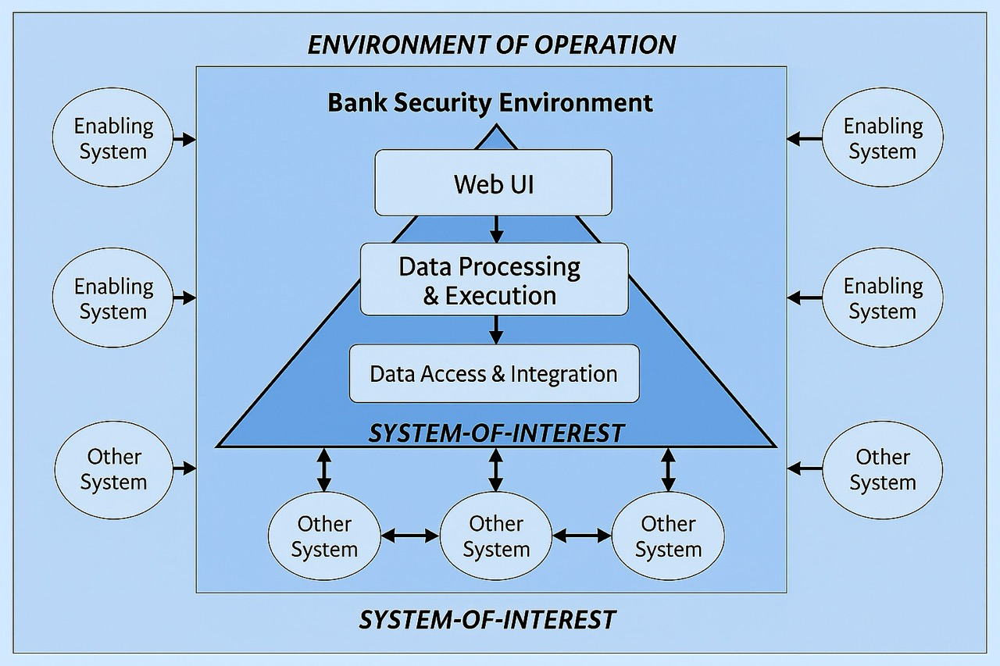

# 📝 Project Proposal: Marimo

  

---

## 📖 OSS Project Description

### What is it?

Marimo is a reactive Python-based notebook for developers. It leverages Jupyter and other data tools for visualization and styling. This allows you to write notebooks like Python files that can run in a cell. This project can help developers deploy notebooks as scripts or web apps, shortening the path from exploration to production.

Features in this project include:

- Stores notebooks as pure Python files for version control and transparency
- Automatic dependency tracking
- Deployment of dependencies as **scripts** or even **web applications**
- Security-aware features such as token-based access, TLS/SSL, encrypted backups, and pluggable authentication middleware suitable for sensitive environments

---

## 📌 Repository & Collaboration

- **Team Repository Link:** https://github.com/os2594/Team4
- **Project Board:** https://github.com/users/os2594/projects/3/views/1
  (Tasks, issues, and cards linked to this board for progress tracking.)

---

## 🏢 Hypothetical Operational Environment

Describe the enterprise, hospital, government, or research setting in which Marimo will be deployed, focusing on how users expect security functionality.

- The hypothetical environment chosen for this project is a Bank, where users would use Marimo software as an enterprise analytics software.
- Primary users include data analysts, data scientists, risk and compliance teams, and DevOps personnel who collaborate on notebooks and deploy analytics artifacts.
- A bank's analytics team uses Marimo as a tool to process financial and customer data. In this situation the security features expected are sensitive data must remain confidential and in some cases encrypted depending on the type of data. The audit logs must be tracked to ensure proper utilization and access management policies. In case of any apps or software were linked to the tool, proper authentication must happen so that only authorized members are able to access data and environment.

---

## 🖥️ Systems Engineering View

### Other systems can include: 
- Identity and Access Management (IAM) - SSO, MFA and RBAC enforcement.
- Hardware Security Modules (HSM) - to provide fast and strong encryption/decryption operations.
- Bank Security Operations Center SIEM tools - for continuos monitoring.
- Compliance and Audit Systems.

---

## 🔐 Security Needs, Threats, and Features

- **Security Needs**
  - Confidentiality: Prevent unauthorized access to code, especially since it's all in .py.
  - Integrity: Ensure all notebookes retain accuracy and have not been tampered.
  - Isolation: Sandboxing, ensure that no use can see another user's notebook.
  - Auditability: Ensure that all documentation is present, and that everything has written documentation.

- **Threats**
  - Malicious Code Execution: Since the notebooks are .py files, they could be tampered and malicious code can be written.
  - Data Leak: No notebooks should have data leaks, and can only be seen by the authorized user.
  - Lateral Movement: If there is no isolation, a threat actor can move around and try to escalate.
  - Denial of Service: Overloading the application and exhausting all the resources.
  

### Marimo: Security & Assurance Surface

This document evaluates the **security-relevant features** of Marimo from a software assurance and quality perspective.  
The intent is to identify controls, strengths, and gaps that affect assurance in enterprise or regulated environments.

---

### ✅ Security Features

#### 🔐 Authentication & Access Control
- **Token / Password Protection**  
  Marimo servers can be configured with access tokens or passwords. This establishes a basic authentication mechanism, preventing anonymous or casual access to notebooks. From an assurance standpoint, this feature is necessary but should be combined with stronger identity management in sensitive deployments.

- **Custom Authentication via ASGI Middleware**  
  Because Marimo runs as an ASGI application, it can be embedded into frameworks like **FastAPI** or **Starlette**. This makes it possible to integrate with enterprise identity systems (LDAP, SAML, OAuth2, OIDC). In practice, this allows deployment teams to enforce Single Sign-On (SSO) policies, meeting organizational assurance requirements such as HIPAA or NIST 800-53.

- **OAuth / External Identity Provider Support**  
  Documented implementations (e.g., Cloudflare PKCE flows) confirm that Marimo can leverage modern OAuth2 authentication methods. This improves trust in multi-user environments by supporting centralized identity governance and MFA (multi-factor authentication).

---

#### 🔒 Data Transmission & Privacy
- **TLS/SSL Encryption**  
  All data transmitted between the Marimo server and client browsers can be secured with TLS/SSL. This protects credentials, sensitive notebook content, and API keys from interception. Assurance requires verifying that TLS is enabled in production deployments.

- **Encrypted Backups and Disk Storage**  
  Database backups and disks storing encryption keys are encrypted. This reduces the impact of stolen or misplaced backup files. For QA, validation of backup encryption processes should be part of the test plan.

- **Data Deletion Policies**  
  Marimo specifies that deleted accounts and notebooks are purged (typically within 60 days). This control helps enforce data minimization principles and reduces the long-term risk of data exposure.

---

#### 🌀 Reproducibility & Hidden State Control
- **Reactive Execution Model**  
  Marimo constructs a dependency graph of notebook cells. When a cell changes, downstream cells are automatically recalculated. This prevents stale data issues that undermine the integrity of analytical outputs. From an assurance perspective, this improves correctness and traceability of results.

- **Elimination of Hidden State**  
  When a cell is deleted, all variables created in that cell are removed from memory. This prevents untracked values from influencing later computations. QA evaluation should confirm this behavior to reduce the risk of reproducibility failures.

- **Pure-Python Notebook Storage**  
  Notebooks are stored as `.py` scripts instead of JSON (`.ipynb`). This makes them easier to review, version control, and audit. Code reviews can identify potential security flaws without dealing with opaque metadata or hidden payloads.

---

#### 🛡️ Deployment Modes
- **Read-Only Mode**  
  Marimo can run in a restricted mode where notebooks are executed but not editable. This control supports safe sharing of notebooks in environments where modification could introduce errors or malicious code.

- **Editable Mode**  
  Full access mode is available for trusted users. Separating “run” from “edit” modes creates a clear trust boundary between viewers and developers, which is a critical assurance principle.

- **Browser/WASM Execution**  
  Some deployments allow Marimo to execute directly in the browser using WebAssembly (Pyodide). In this configuration, code runs on the client side, reducing the exposure of backend systems.

- **Public Sharing / Gallery**  
  Public sharing features expand collaboration but widen the threat surface. QA analysis should include risk modeling for scenarios where notebooks are shared beyond organizational boundaries.

---

#### 📦 Dependency & Execution Safety
- **Serialized Package Requirements**  
  Marimo notebooks capture their dependency versions. This supports reproducibility and enables organizations to audit dependencies for known vulnerabilities, a key assurance activity.

- **Virtual Environment Support**  
  Marimo supports execution within Python virtual environments. This isolates dependencies across projects, reducing the risk of conflicts or dependency confusion attacks.

- **Execution Controls for Expensive Cells**  
  Users can disable automatic execution of high-cost cells. This prevents resource exhaustion and improves stability in shared environments. QA scenarios should test these safeguards under load.

---

#### 🗄️ Privacy & Data Protection
- **Encrypted Backups**  
  Backup encryption ensures data is protected if copies are leaked or stolen. This should be verified in operational testing.

- **Secure Deletion Practices**  
  Account cancellation and content deletion result in data being purged. This helps meet privacy regulations and user expectations around data lifecycle.

- **Database Encryption (Limitations)**  
  While backups and keys are encrypted, most “live” database data is not encrypted at rest. This is a limitation that increases reliance on perimeter and access controls for assurance.

---

## ⚠️ Gaps & Areas to Improve
From a QA and assurance perspective, the following areas require further maturity:
- **Role-Based Access Control (RBAC)**: No built-in multi-role system (admin, editor, viewer). Enterprises must implement externally.  
- **Comprehensive Encryption at Rest**: Database contents should ideally be fully encrypted, not just backups.  
- **Audit Logging**: Detailed logs of user actions and executed code are not yet a first-class feature. Lack of logging reduces accountability.  
- **External Integrations**: Each API or AI integration expands the attack surface. Proper credential management and input sanitization are necessary.  
- **Public Sharing Controls**: Public gallery features require guardrails (sandboxing, scanning, rate limits) to avoid exposure risks.

---

## 📌 Assurance Significance
Marimo demonstrates that it is more than a developer utility; it is a platform with **clear security considerations**:
- Identity and authentication are flexible but must be configured carefully.  
- Data integrity is strengthened by reactive execution and hidden state elimination.  
- Confidentiality is protected by TLS and encrypted backups, though gaps remain in encryption at rest.  
- Auditability and compliance require additional controls (RBAC, logging).  

From a software assurance perspective, these features and gaps provide substantial material for evaluating **trust, risk, and assurance in real operational environments**.

---

## 🎯 Team Motivation

Explain why your group selected Marimo:

- Popularity and active development
- Enterprise or educational use cases
- Clear security considerations
- Rich opportunities for assurance analysis

For this assignment, our team was required to evaluate and select an open-source software project that offers meaningful opportunities for **security and assurance analysis**. After considering multiple options, we chose **Marimo** because it stood out as both technically innovative and highly relevant to real organizational use cases.

Marimo is a **reactive Python notebook environment** that addresses long-standing issues with tools like Jupyter, including hidden state, reproducibility challenges, and limited auditability. By storing notebooks as pure Python (`.py`) files, Marimo enables greater transparency, version control, and security-aware workflows. Its **reactive execution model** ensures results remain consistent, while deployment modes (edit vs. run-only, server-based vs. browser-based) provide flexibility for both secure collaboration and development.

Our motivation for selecting Marimo is based on several key factors:

- **Popularity and Active Development**  
  Marimo is under active development, with a growing contributor base and regular releases. Its presence on GitHub and in developer communities shows strong momentum and engagement.

- **Enterprise and Educational Use Cases**  
  Marimo is already used across **universities, research institutions, and organizations** that require reproducibility and secure collaboration. Its design also makes it a strong theoretical fit for enterprise and government settings where security and assurance are critical.

- **Clear Security Considerations**  
  Features like token-based authentication, TLS/SSL support, encrypted backups, hidden state elimination, and integration with external identity providers give Marimo a distinct **security surface** to analyze. At the same time, current gaps (RBAC, audit logging, full encryption at rest) provide room to reason about trust and improvement opportunities.

- **Rich Opportunities for Assurance Analysis**  
  Marimo operates at the intersection of code execution, data handling, and collaborative use. This allows us to systematically examine trust boundaries, risk scenarios, and assurance measures across multiple components, from authentication and data privacy to dependency management and deployment controls.

In summary, Marimo was selected because it is not just an innovative notebook tool—it is a **maturing open-source platform** with real adoption, meaningful security requirements, and clear opportunities for systematic assurance evaluation. This combination makes it an intelligent and well-justified choice for our team’s project.

---

### Contributors and Community Activity

- **Contributors:** 179 (at the time of writing)
- **Community activity:** Very active, with updates to non-main branches from today and going back a few weeks.

---

### Popularity (Stars, Forks, Adoption)

- **Stars:** 15.9k
- **Forks:** 681
- **Adoption:** Fairly popular with a sizable community and consistent engagement.

---

### Languages and Platform

- **Primary Language:** Python
- **Additional Language:** TypeScript (used mainly for Playwright tools supporting regression and validation testing)

---

### Documentation Sources

The project’s documentation is limited to the following markdown files:

- `README.md`
- `LICENSE`
- `CODE_OF_CONDUCT.md`
- `CONTRIBUTING.md`
- `SECURITY.md`

---

## 📜 License Summary & Contribution Agreement

The **Marimo project** uses the **Apache License Version 2.0**.
This license defines the spirit of open-source software, allowing us to contribute and make changes freely.

By leveraging this license, our team can contribute effectively, complete analysis, and improve software assurance.

#### What This License Allows

- **Use it freely**: You can use the software for personal, educational, or commercial purposes without needing permission or paying royalties.
- **Modify it**: You can change the source code however you like.
- **Distribute it**: You can share the original or your modified version.
- **Sell it**: You can use it in a product you sell (including closed-source products), if you follow the rules.
- **Sublicense**: You can bundle it with other software, including proprietary software.

**License**: [Apache License 2.0](https://github.com/marimo-team/marimo/blob/main/LICENSE)

---

### Code of Conduct

The **Code of Conduct** outlines expectations for collaboration and contribution.
It emphasizes being **respectful, kind, and open**.

#### Maintainers’ Responsibilities

- Project maintainers can set and enforce rules.
- They may remove, edit, or reject contributions, and enforce commitments against the project.

As a team, we must follow all rules associated with Marimo to remain in compliance.

#### Reporting Issues

- If you encounter misconduct or issues, you can report them.
- Use the official contact email: **contact@marimo.io**.

**Code of Conduct**: [Contributor Covenant](https://github.com/marimo-team/marimo/blob/main/CODE_OF_CONDUCT.md)

---

### Contribution Guidelines

Contributing is defined in the **CONTRIBUTING.md** file.
The project accepts **code, tests, documentation, bug fixes, and even typo corrections**.

#### Before Submitting a Pull Request

You are expected to:

- Run linting, typechecking, and formatting → make sure your code follows style rules.
- Write tests for your code.
- Run all tests to ensure nothing breaks.
- Read and sign the **Contributor License Agreement (CLA)**.

The documentation also provides setup instructions and common commands.You are expected to:

- Keep code clean and consistent.
- Follow good programming practices (e.g., **single responsibility principle**).
- Write and run regression tests with **Playwright scripts**.

#### Contributor License Agreement (CLA)

- You must state that you have read and signed the CLA on your **first pull request**.
- The CLA gives Marimo the right to use your contributions forever.
- You confirm that:
  - You have the legal rights to contribute.
  - Any third-party code references are disclosed.
  - Contributions are provided **“as is”** without warranty or obligation for future support.

**CLA**: [Contributor License Agreement](https://marimo.io/cla)
**Contributing Guide**: [CONTRIBUTING.md](https://github.com/marimo-team/marimo/blob/main/CONTRIBUTING.md)

---

## 🕵️ Security History

Briefly cover:

- Past Vulnerabilities:
  - Transisitive dependency vulnerability: A public CVE examines a path-to-regexp dependency by patching and updating from v7.x to v8.x. 

- Security-relevant design decisions (e.g., hidden state elimination, `.py` file format)
  - Most files are stored as .py notebooks, which increases functionality but can present some security concerns.
  - No hidden state: UI interaction and deleting cell scrubs.
  - Package Sandboxing: Store things in virtual notebooks to allow for synchronization.

- Past or ongoing enhancements related to security
  - Auto updates: dependency updates to patch vulenrabilities like the path-to-regexp.
  - Constant sandboxing updates.
  - Auto exports and snapshots.
---

## 📋 Project Planning, Tracking & Reflection

- **Planning & Tracking**: Use GitHub Project Board to assign tasks, link issues, and monitor progress.
- **Reflection**: Each member adds an individual reflection:

---

  *Justin Tobiason*

  - What did I learn from this assignment?
    - I definetly understand a bit more regarding the information that an OSS needs to share and maintain for both leagal and ehtical reasons.
  - What was most useful to me?
    - The most valuable thing I took away is it's important to incorporate a Contributor License Agreement to ensure that your contributors and open up a civil disagreement about logic they commited.

---

  *Dominic Lanzante*
  - What did I learn from this assignment?  
    - I learned how important it is to evaluate open-source projects not just for functionality but also for their security and assurance features. This assignment showed me how systematic reasoning can be applied to real-world projects and why organizations rely on strong security models.  

  - What was most useful to me?  
    - The most useful part was applying the evaluation framework to an active project like Marimo. It gave me a better understanding of authentication, data protection, and reproducibility, and how these assurance principles directly affect trust decisions in organizational environments.  

---

  *Preeti Timalsina*
  - What did I learn from this assignment?
    - I feel like I understand a little bit better on the specific security needs depending on the hypothetical enviroment and how it can vary with the usecase.
  - What was most useful to me?  
    - One thing I can take away from reviewing this is that security is something that must go hand on hand even though technicnically majority may be focused on the functionality, If security is ignored the whole usecase may discmiss itself for a good project.

---

 *Osmar Carboney*
  - What did I learn from this assignment?
    - I learned how to easy is to create Projects and kanban boards in github to keep  track of tasks and issues. I also learned how our proposed open-source project can enhance the productivity of a bank by developing and testing pyhton code and lastly deploying web applications.
  - What was most useful to me?  
    - I think teams and github were very useful tool for this first assignment as it allowed the whole team to communicate almost instantly and also to share content/images. Also using copilot is useful for a quick analysis vs spending hours to figure out what a piece of code does. 

---

*Zaid Kakish*
- What did I learn from this assignment?
  - I learned how to conduct a security assessment of past vulnerabilties and the strcuture of an open source systeem, by looking at the source code, and accurately identifying events to corresponds with CVEs
- What was most useful to me?
  - Understanding how contributions work to open source systems, and how  security is a measure that must be taken to protect all sorts of systems. It is harder for open source as the source code is there.

---
