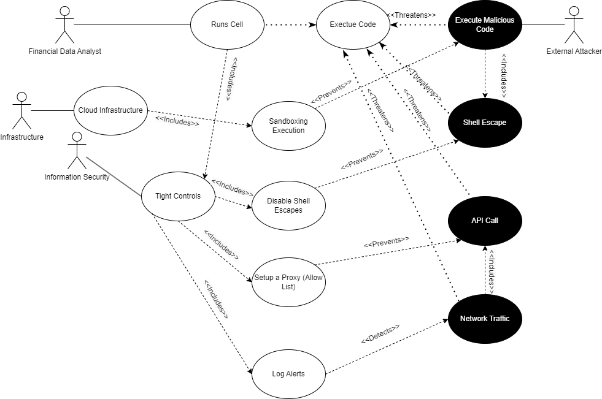

# **Requirements For SoftwareSecurity Engineering**

### **Data exfiltration**

###### **Internal Misuse Case:** Rogue Employee

A financial analyst with elevated access uses Marimo to query sensitive customer data and exports it via an 						unmonitored notebook deployment.

* **Threat** : Data exfiltration
* **Aggravating Factors** : Loose access controls
* **Mitigation** : Strict RBAC, access logging, deployment review workflows.

###### **External Misuse Case:** External attacker

An attacker discovers a misconfigured Marimo notebook deployed as a public web app and uses SQL injection to access backend financial data.

* **Threat** : Unauthorized data access
* **Aggravating Factors** : Unvalidated inputs
* **Mitigation** : Input sanitization

###### **List of security requirements derived from data exfiltration analysis**

Derived from the internal (rogue employee) and external (hacker via SQL injection) misuse scenarios, these requirements ensure Marimo in a financial institution resists data-exfiltration:

1. **SR-1: Role-Based Access Control (RBAC)**
   The system shall restrict notebook export and data-download capabilities to explicitly authorized roles. Export attempts by users without the `Data export` privilege must be denied.
2. **SR-2: Immutable Audit Logging**
   Log every notebook execution, SQL query, and export action—capturing user ID, timestamp, query parameters—in immutable logs retained for at least 180 days.
3. **SR-3: Data Leakage Prevention (DLP) Scanning**
   Prior to any export, scan payloads for regulated or high-sensitivity fields (e.g., SSNs, credit cards). Matches must block the export and trigger a security alert.

4.  **SR-4: Input Validation & Parameterized Queries**
   All SQL cell executions shall use parameterized queries. User inputs must be sanitized or bound as parameters to eliminate injection vectors.

###### **Alignment with Marimo’s Advertised Features**

* **Authentication & RBAC** : Marimo offers token abstractions (`AuthToken`) and ASGI middleware hooks, but does not ship with enterprise SSO, RBAC, or MFA integrations. Maybe these implementations are done through an other environment that Institutions must put in place.
* **Input sanitization** : While Marimo’s SQL cells can leverage parameterized drivers, there is no enforcement mechanism to prevent raw string concatenation—placing the onus on notebook authors.

### **Malicious Code Execution**

**Actor:** Financial Data Analyst  
**Interaction:** Run Notebook Cell and See Results  

**Description:**  
The essential interaction is when a financial data analyst writes Python code in a notebook cell and executes it. The notebook environment evaluates the code, updates results (tables, outputs, or visualizations), and ensures computations remain reproducible and reactive.  

---

###### Why this is Essential
- This represents the primary value proposition of the notebook system: interactive, reproducible computation.  
- It links the financial analyst with the system in its operational environment which is meant to analyze financial data.  
- It triggers the notebook’s dependency tracking and cell re-execution features.  

---

###### Anti Use Case

**Normal Use Case**  
- **Actor (User):** Financial Analyst  
- **System-of-Interest:** Notebook executes analyst’s Python code in a reactive cell, tracks dependencies, and shows results.  

---

###### Misusers (Contextualized for an Enterprise Environment)

1. **External Attacker**  
   - **Motive:** Inject malicious payloads to run code in the notebook (e.g., cryptominer, data theft).  
   - **Resources/Access:** Gains access via phishing, misconfiguration, or weak access controls.  
   - **Attack of Choice:** Execute malicious code by abusing notebook execution to run system commands, launch API calls, or modify the system.  

2. **Malicious Insider**  
   - **Motive:** Abuse legitimate access to unauthorized code.  
   - **Resources/Access:** Valid notebook credentials and execution rights.  
   - **Attack of Choice:** Leverage cell execution to bypass sandboxing and attempt privilege escalation or data exfiltration.  

---

###### Misuse Cases
- **Misuse Case 1:** Execute Malicious Code in Notebook Cell  
- **Misuse Case 2:** Shell Escape / Execute Unauthorized System Commands  
- **Misuse Case 3:** Abuse API Calls to Curl scripts outside of the environment  
- **Misuse Case 4:** Execute Calls via Python to external sources (Network Traffic)  

---

###### Security Requirements (Countermeasures)

1. **Sandbox Execution Environment**  
   - All notebook cells must run in a restricted execution environment with minimum privileges.  
   - Enforce read-only access to sensitive file paths.  
   - Restrict installation of arbitrary dependencies.  

2. **Disable Shell Escapes**  
   - Remove the ability to invoke system-level commands from inside notebooks (`!bash`, `subprocess`, etc.).  

3. **Controlled API Calls via Proxy**  
   - Only allow outbound API requests to pre-approved destinations through a proxy on an allow list.  
   - Deny all other API traffic.  

4. **Audit Logging of Network Traffic**  
   - Monitor and log all outbound connections from notebook kernels.  
   - Generate alerts on anomalous patterns or unauthorized sites.  
