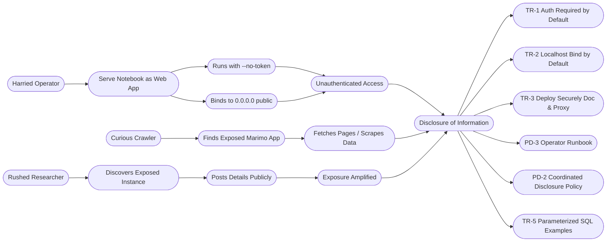

# **Requirements For SoftwareSecurity Engineering**

## **1. Data exfiltration - Osmar Carboney**

**Actor:** Financial Analyst or External Attacker 
**Interaction:** Export Notebook or Execute SQL Query via Web Interface

**Description:** The essential interaction occurs when a financial analyst uses Marimo to query sensitive customer data and exports results for reporting or analysis. This interaction is central to the notebook’s value in the financial institution enabling reproducible, data-driven insights. However, the same export and query mechanisms can be abused by an insider or external attacker to extract confidential data.

**Why This Is Essential**

This interaction represents a core operational capability: transforming raw financial data into actionable insights. Analysts rely on notebook exports to share dashboards, generate reports, and collaborate across teams.

###### **Internal Misuse Case:** Rogue Employee

A financial analyst with elevated access uses Marimo to query sensitive customer data and exports it via an unmonitored notebook deployment.

* **Threat** : Data exfiltration
* **Aggravating Factors** : Loose access controls
* **Mitigation** : Strict RBAC, access logging, deployment review workflows.

###### **External Misuse Case:** External attacker

An attacker discovers a misconfigured Marimo notebook deployed as a public web app and uses SQL injection to access backend financial data.

* **Threat** : Data exfilitration via unauthorized data access
* **Aggravating Factors** : Unvalidated inputs
* **Mitigation** : Input sanitization

###### **List of security requirements derived from data exfiltration analysis**

Derived from the internal (rogue employee) and external (hacker via SQL injection) misuse scenarios, these requirements ensure Marimo in a financial institution resists data-exfiltration:

1. **SR-1: Role-Based Access Control (RBAC)**
   The system shall restrict notebook export and data-download capabilities to explicitly authorized roles. Export attempts by users without the `Data export` privilege must be denied.
2. **SR-2: Immutable Audit Logging**
   Log every notebook execution, SQL query, and export action—capturing user ID, timestamp, query parameters—in immutable logs retained for at least 180 days.
3. **SR-3: Data Leakage Prevention (DLP) Scanning**
   Prior to any export, scan payloads for regulated or high-sensitivity fields (e.g., SSNs, credit cards). Matches must block the export and trigger a security alert.

4.  **SR-4: Input Validation & Parameterized Queries**
   All SQL cell executions shall use parameterized queries. User inputs must be sanitized or bound as parameters to eliminate injection vectors.

---

## **2. Malicious Code Execution - Justin Tobiason**

**Actor:** Financial Data Analyst  
**Interaction:** Run Notebook Cell and See Results  

**Description:**  
The essential interaction is when a financial data analyst writes Python code in a notebook cell and executes it. The notebook environment evaluates the code, updates results (tables, outputs, or visualizations), and ensures computations remain reproducible and reactive.  

###### Why this is Essential
- This represents the primary value proposition of the notebook system: interactive, reproducible computation.  
- It links the financial analyst with the system in its operational environment which is meant to analyze financial data.  
- It triggers the notebook’s dependency tracking and cell re-execution features.  

###### Anti Use Case

**Normal Use Case**  
- **Actor (User):** Financial Analyst  
- **System-of-Interest:** Notebook executes analyst’s Python code in a reactive cell, tracks dependencies, and shows results.  

###### Misusers 

1. **External Attacker**  
   - **Motive:** Inject malicious payloads to run code in the notebook (e.g., cryptominer, data theft).  
   - **Resources/Access:** Gains access via phishing, misconfiguration, or weak access controls.  
   - **Attack of Choice:** Execute malicious code by abusing notebook execution to run system commands, launch API calls, or modify the system.  

###### Misuse Cases
- **Misuse Case 1:** Execute Malicious Code in Notebook Cell  
- **Misuse Case 2:** Shell Escape / Execute Unauthorized System Commands  
- **Misuse Case 3:** Abuse API Calls to Curl scripts outside of the environment  
- **Misuse Case 4:** Execute Calls via Python to external sources (Network Traffic)  

###### Security Requirements (Countermeasures)

1. **Sandbox Execution Environment**  
   - All notebook cells must run in a restricted execution environment with minimum privileges.  
   - Enforce read-only access to sensitive file paths.  
   - Restrict installation of arbitrary dependencies.  

2. **Disable Shell Escapes**  
   - Remove the ability to invoke system-level commands from inside notebooks (`!bash`, `subprocess`, etc.).  

3. **Controlled API Calls via Proxy**  
   - Only allow outbound API requests to pre-approved destinations through a proxy on an allow list.  
   - Deny all other API traffic.  

4. **Audit Logging of Network Traffic**  
   - Monitor and log all outbound connections from notebook kernels.  
   - Generate alerts on anomalous patterns or unauthorized sites.  

---

## 3. Disclosure of Information via Publicly Exposed Marimo App - Dominic Lanzante  

**Description:**  
If a Marimo app is started without effective authentication or is bound to a public interface, anyone who can reach the URL may view internal dashboards or data.  

**Actors & Motives:**  
- **Curious Crawler** — opportunistic scanner that finds exposed apps  
- **Rushed Researcher** — stumbles on exposure and posts details publicly instead of reporting privately  
- **Harried Operator** — deploys with `--no-token` or `--host 0.0.0.0` due to time pressure  

**Access Required:**  
- Only a web browser or basic scanning tools; no insider privilege  

### Misuse → Mitigations → Requirements

#### Stage 0 — Baseline Risk
- Operator launches Marimo without auth, exposed to the internet  
- **Impact:** Sensitive dashboards or data leakage  

#### Stage 1 — Security Functions
- Auth middleware & token flow (already documented)  
- CLI defaults: bind to localhost, require token  
- **Residual gap:** Users may override/ignore protections  

#### Stage 2 — Stronger Controls
- Add “Deploy Securely” checklist & proxy sample (TLS, rate-limits)  
- Provide operator runbook for exposed instances  
- **Residual gap:** Exposures may still be publicized before patch  

#### Stage 3 — Vulnerability Management
- Update `SECURITY.md` with SLA (72h acknowledgement), embargo wording, and attribution  

#### Visual (from draw.io)

#### Text-based (Mermaid for GitHub rendering)

### Derived Security Requirements

#### Process (Policy & Operations)

- **PD-1 Private reporting channel with 72h SLA**  
  - *Requirement:* `SECURITY.md` must specify private channels (GitHub advisory/email) and commit to acknowledgement within 72 hours  
  - *Test:* Submit benign test advisory → receive auto acknowledgement within 72h  

- **PD-2 Coordinated disclosure (no public PoCs pre-fix)**  
  - *Requirement:* `SECURITY.md` requests no public PoCs/blogs until fix is released; offers attribution  
  - *Test:* Policy text visible in repo  

- **PD-3 Operator runbook for “Exposed Instance”**  
  - *Requirement:* Add `docs/runbooks/exposed-instance.md` with disable/rotate/notify steps  
  - *Test:* File exists with clear response actions  

#### Technical (Defaults, Docs, Guides)

- **TR-1 Auth required by default**  
  - *Requirement:* Default serving requires token/password; using `--no-token` prints visible warning  
  - *Test:* Fresh run prompts for token; disabling prints warning  

- **TR-2 Localhost bind by default**  
  - *Requirement:* Default host = `127.0.0.1`; binding to `0.0.0.0` requires explicit flag and warning  
  - *Test:* Fresh run binds locally; public bind prints warning  

- **TR-3 “Deploy Securely” doc & proxy sample**  
  - *Requirement:* New doc with TLS, rate-limits, request-size caps, and middleware snippet  
  - *Test:* Following doc yields hardened HTTPS-only deployment  

- **TR-4 Public sharing steered to WASM playground**  
  - *Requirement:* Docs advise WASM playground for public embedding; server-backed apps reserved for private use  
  - *Test:* Docs show explicit guidance  

- **TR-5 Parameterized SQL in examples**  
  - *Requirement:* Replace concatenated SQL with parameterized queries in docs  
  - *Test:* Examples include “do/don’t” notes on safe queries  

### Alignment with Marimo Features
- **Auth & middleware** → already documented; requirements strengthen defaults  
- **CLI defaults** → already localhost; requirements add warnings for unsafe configs  
- **WASM playground** → already provided; reinforced as safe sharing method  
- **SQL integration** → update examples to highlight safe practices  
- **Security policy** → exists but enhanced with SLA and disclosure guardrails  

---

## 4. Denial of Service (DoS) – Preeti Timalsina  

**Description:**  
In a financial enterprise environment, analysts rely on marimo notebooks to run interactive queries against large transaction datasets. If queries are poorly designed or maliciously crafted, they can consume excessive memory, CPU, or database I/O. This leads to system slowdowns, notebook crashes, or even complete service outages, preventing other analysts from completing their work.   

**Actors & Misusers:**  
- **Accidental Analyst** — unintentionally executes a heavy query (e.g., SELECT * on millions of rows).  
- **Disruptive Insider** — deliberately runs expensive queries or multiple sessions to degrade availability.  
- **External Attacker** — abuses misconfigured deployments to flood the system with costly requests.  

### Misuse Cases

#### Misuse Case 1
- Single runaway query that consumes excessive CPU or RAM.     

#### Misuse Case 2
- Repeated medium-cost queries that evade single-query caps (“low-and-slow” attack). 

#### Misuse Case 3
- Parallel notebooks or sessions opened to overwhelm shared resources.  

#### Misuse Case 4
- Attempted bypass by spawning subprocesses or unauthorized outbound calls.  

#### Visual (from draw.io)
- 
---

### Mitigations and Derived Security Requirements with Acceptance Criteria

- **SR-1: Execution Limits**  
  - Each notebook cell must enforce runtime and memory thresholds (e.g., 120s, 2GB). Queries exceeding these limits must be terminated automatically.
  - Acceptance Criteria
    -- A query exceeding configured time or memory (e.g., 120s or 2 GiB) is automatically killed, the user sees a termination error, and the event is logged with user, session, query hash, and reason.

- **SR-2: Query Governor**  
  - Before execution, queries should be cost-estimated. High-cost patterns (cartesian joins, unbounded scans) must be blocked or require approval.
  - Acceptance Criteria
    -- When a query matches a banned pattern or exceeds the cost threshold, execution is denied or requires explicit approval, and the action is logged.

- **SR-3: Rate Limiting & Resource Budgets**  
  - Analyst accounts must be limited to a fixed number of queries per minute and rolling daily CPU/IO budgets. Excess queries must be queued or denied.
  - Accptance Criteria
    -- When a user exceeds rate or budget limits, further queries are queued or denied with a clear “rate limited” message, and the event is logged.

- **SR-4: Concurrency Management**  
  - No more than three concurrent queries may be executed per user. Additional queries must be queued.
  - Acceptance Criteria
    -- Submitting more than the allowed concurrent queries runs only up to the limit while the rest are queued, preserving responsiveness for other tenants
 
- **SR-5: Sandbox Enforcement**  
  - Subprocess creation and unauthorized network calls must be blocked inside the notebook environment. All denied attempts must be logged.
  - Acceptance Criteria
   -- Attempts to spawn a process or contact a disallowed host fail with a policy error and are recorded in the audit log.
 
- **SR-6: Monitoring & Alerts**  
  - The system must log query kills, throttling, and sandbox violations. Alerts should trigger when kill rates or queue delays exceed thresholds (e.g., >5 kills/min or >120s queue wait).
  - Acceptance Criteria
    -- When kill rates or queue delays exceed thresholds (e.g., >5 kills/min or p95 wait >120s), an automated alert is sent to on-call staff with tenant/session details.

### Alignment with Marimo Features
- **Strengths**
  Marimo’s reactive notebooks and plain .py format support reproducibility and auditability. 
  Deployment flexibility (e.g., containers, WASM) makes it compatible with external quota and isolation tools. 
- **Gaps**
  Marimo does not natively enforce runtime/memory caps, rate limits, or query governors.
  Sandbox and workload isolation must be configured at the environment or orchestration layer. 
- **Conclusion** While marimo provides the interactive notebook foundation, DoS protections must be layered in at deployment time to ensure availability and fairness in a financial enterprise setting.

---

## 5. Debug Mode Exploitation – Zaid Kakish

**Description:** Run the Marimo web application in debug mode during development to display detailed errors and logs.

**Actors:**
- **External Actor:** Unauthenticated user probing the public application with the intention to attack the system.
- **Internal Actor**: An insider threat purposefully deploying the system to production with debug mode.

Interaction: The attacker runs debug mode to access logs and credential.

**Why this is essential:**

Debug mode is a very common misconfiguration in python and web applications in various deployment environments If debug mode is present in production environments, it could leak out critical details such as system paths, logs, and potential credentials. Debug mode is not a code vulnerability, but instead an error when it comes to deploying code in production environemnts. This is a critical and easy mistake to make as it relies on ensuring that there are checks in place or alerts for debug mode. If no alerts are presents and a code goes live, it could not be noticed.

**Misuse Cases:**

1- Internal Attacker
- A developer or insider leaves debug mode set on True inside a development environment
  - **Threat**: Data Breach
  - **Attack Vector**: Exposed debug tools
  - **Mitigation**: Ensure debug=False, Startup checks, Access Control
 
2 - External Attacker
- An attacker sends malformed input in a production environment and is able to intercept error messages which can provide insight on system paths, logs, and potential credentials. 
 - **Threat**: Unauthorized Access
 - **Attack Vector**: Debug interface messages and logs
 - **Mitigation**: Role Based Access Control for Debug, Alerts, IDS

Security requirements to put into place

1- SR-001 **Debug mode deployment checks**: The system should automatically prevent or refuse deployment in any environment that is labeled as production.

2- SR-002: **Error Message Security**: The system should not expose or issue any message that may identify system paths, stacks traces, variables, or logs, as part of debug mode.

3- SR-003 **Role Based Access Control**: All debug features and access should require the proper level of authetication and authroization.

4- SR-004 **Alerts**: Alerts in place to warn the user if debug mode is active. 

---

### AI Assistance Note
I used AI tools to help **structure my misuse case analysis**.  
Specifically, I asked for help in:  
- Clarifying the misuse case and actors.  
- Turning mitigations into **clear, testable requirements**.  
- Thinking about **residual risks and stronger controls**.  

All analysis, alignment to the rubric, and final documentation were the teams own work.

---

## Reflection (Individual Contribution)

**Preeti Timalsina**: 

AI Prompt Used: 
I used the same prompt provided by the professor, but adapted it to my misuse case of Denial of Service. The prompt asked an expert software security requirements engineer to suggest misuse cases and countermeasures for the use case: “A financial analyst runs queries in a notebook to analyze large transaction datasets,” focusing on DoS risks like runaway queries, storms, and amplification patterns.

Reflection: 
The prompt was useful for identifying the right actors (analyst, insider, external attacker) and the specific actions they might take that could cause a Denial of Service. It also helped me think more thoroughly about how to define acceptance criteria for each security requirement so they would be clear and testable. In addition, I used the AI for minor guidance on designing my draw.io diagram, which made it easier to keep the layout consistent with my teammates’ diagrams.

**Justin Tobiason**: 

AI Prompt Used: 
I leveraged a prompt that guided my essential interaction and the possible misuse cases. It read, "A financial data analyst executes a python cell in marimo to return analytics". The prompt lead me down a path that focuses on the potential to run malicious code in the cell and what that could look like. Then I attempted to determine additional scenarios that could be achieved at each level by an attacker. 

Reflection: 
By using the prompt I was able to identify more scenarios in addition to the potential routes they could take. I was able to juxtapose some of the information into a diagram providing a clear picture of the threats and mitigations that make up the use case. 

**Dominic Lanzante**:

AI Prompt Used:
AI tools were utilized throughout this project primarily for phrasing assistance, brainstorming rebuttals, and refining the structure of my assurance case. However, many of the generated responses were **incomplete, inaccurate, or inconsistent** with the Marimo project’s actual repository content. While AI helped me organize initial ideas, the technical details and diagrams it produced were often **lacking in precision and reliability**. Because of this, I relied heavily on the **course textbooks, professor-guided videos, and manual verification** to ensure my final submission accurately reflected the required assurance structure and evidence. AI ultimately served as a light editorial tool rather than a dependable source of technical accuracy.

Refelction:
Working on this misuse case showed that defaults and documentation are as important as code in preventing exposures. A single CLI flag or unclear deployment doc can leak sensitive data. OSS projects must therefore combine technical controls (secure defaults) with process controls (coordinated disclosure, operator runbooks). My work here complements the other team interactions by ensuring secure deployment and policy baselines that reinforce their features. Working on the Denial of Service misuse case showed me how to turn a broad availability risk into clear, testable requirements. I learned that DoS isn’t just heavy queries and it also includes patterns like storms and slow drains. Writing acceptance criteria was most useful because it made each requirement measurable and practical.

**Osmar Carboney**:

AI Prompts Used:

Reflection:

**Zaid Kakish**:

AI Prompts Used:

Reflection: 

---

# Summarization of Improvements for Marimo

1. Importing a module that can trigger a package installation means all the runtime code and dependencry resolution are dynamic and this could definetly be exploited. This could provide an attack vector to a malicious actor looking to install something to give them more access, break the software, or retreive data. I would like to evaluate the functionality and how easy it is to install malicious packages. - JT
2. User isolation was another concern. If multiple financial analysts are using the notebook could they affect each others environment or read another user's data? I think we can experiment and validate the truth to this. - JT
   
4. What I found most interesting about this assignment was seeing how a small configuration choice, like a CLI flag or default binding, can create a huge security risk if not properly managed. It showed me that security isn’t just about writing strong code but also about guiding users with safe defaults, warnings, and clear documentation. This made me appreciate how much influence deployment and human behavior have in shaping the overall security of an open-source system. - DL
5. The main concern I identified in the Marimo project is that while it offers authentication middleware and defaults to localhost, these protections can be easily bypassed with simple flags like --no-token or --host 0.0.0.0. This creates the risk of exposing sensitive notebooks or dashboards to the public internet. By incorporating my misuse case into their roadmap, Marimo could improve security by making safer defaults non-optional, adding stronger CLI warnings, and creating clear deployment guides and operator runbooks. These steps would help prevent accidental disclosures and make it easier for maintainers and users to follow secure practices directly from the project’s GitHub. - DL
   
7. **Authentication & RBAC** : Marimo offers token abstractions (`AuthToken`) and ASGI middleware hooks, but does not ship with enterprise SSO, RBAC, or MFA integrations. Maybe these implementations are done through an other environment that Institutions must put in place. - Osmar C.
8. **Input sanitization** : While Marimo’s SQL cells can leverage parameterized drivers, there is no enforcement mechanism to prevent raw string concatenation—placing the onus on notebook authors. - Osmar C.
   
10. One area I noticed missing in Marimo’s documentation is guidance on resource management. There’s no mention of query timeouts, memory caps, or concurrency controls that could prevent users from unintentionally overloading the system. Clear documentation around these safeguards would help reduce the risk of denial of service. – Preeti T.
11. I also found that there’s little coverage of monitoring or alerting practices. Operators aren’t given examples of how to track unusual behavior such as repeated query crashes or spikes in resource use. Adding recommendations for integration with tools like Prometheus or Grafana would make it easier to catch and respond to issues early. – Preeti T.
    
13. With public facing notebooks, there absolutely needs to be some sort of authorization mechanism to ensure no one can get access to sensitive logs or staes from debug mode. By implementing some sort of authentication mechanism to ensure the person claims they are who they say there, and authorizing them to understand their level access, this could limit the issue of debug mode. - Zaid K
    
---
