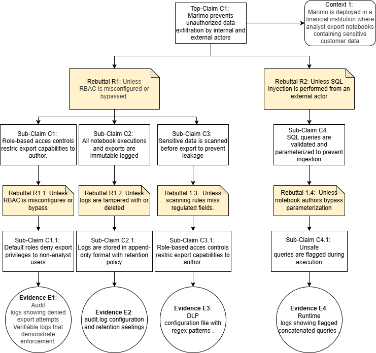

# Part 1 - Top Level Claims

## Assurance Case: Execution Isolation in Marimo - Justin Tobiason

### 1. Overview

This assurance case focuses on **Execution Isolation** within the Marimo project.
The goal is to evaluate whether Marimo’s notebook execution environment can effectively prevent **untrusted user code** from accessing host system resources.

Because Marimo executes arbitrary Python code inside interactive notebook cells, strong isolation controls are required to ensure user-level code cannot escape its intended runtime environment or compromise the underlying host system.

This claim is critical because Marimo’s primary function—reactive code execution—presents inherent risks if isolation is incomplete or misconfigured.

### 2. Top-Level Claim (C1)

**C1:**
*The execution environment prevents host resource access by untrusted code.*

**Intent:**
This claim asserts that when a notebook is executed, it runs within a confined environment that protects the host system’s confidentiality, integrity, and availability.

### 3. Argument Summary

The argument to support this claim is structured around **three key assurance dimensions**:

1. **Systemic Isolation Controls:**The system’s containerization and sandboxing features prevent untrusted code from escaping into the host.
2. **Configuration and Deployment Assurance:**Security configurations (capabilities, mount restrictions, network policies) are actively managed and verified.
3. **Runtime Safeguards:**
   Timeouts and resource limits restrict denial-of-service or covert channel attacks.

Each of these elements is supported by subclaims and tangible evidence, with corresponding rebuttals and refutations.

### 4. Diagram

### 5. AI Summary

I was able to use AI to help expand on futhur rebuttals that could be assessed. By challenging my current claims I proposed my claims with the guidance on how to write a good claim by providing the criteria that make up a good claim. I was able to go from simple less direct claims to something that could provide a reasonable outcome.

---

## Assurance Case: Data Loss Prevention in Marimo - Osmar Carboney

### 1. Overview

This assurance case focuses on **Data Exfiltration Prevention** within the Marimo project. The goal is to evaluate whether Marimo’s notebook interface can effectively prevent unauthorized internal or external actors from leaking sensitive data. Because Marimo enables interactive code execution and notebook export, strong controls are required to ensure that sensitive information is not exfiltrated through misuse, misconfiguration, or malicious code.

This claim is critical because Marimo is often deployed in environments where analysts handle regulated data (e.g., financial records, PII), and any leakage could result in compliance violations or reputational damage.

### 2. Top-Level Claim (C1)

**C1:**
*Marimo prevents unauthorized data exfiltration by internal and external actors.*

**Intent:**
This claim asserts that Marimo enforces layered controls—access restrictions, audit logging, data scanning, and query validation—to ensure that sensitive data cannot be exported or leaked without authorization.

### 3. Argument Summary

The argument to support this claim is structured around four key assurance dimensions:

1. **Access Control Enforcement:** Role-based access control (RBAC) ensures only authorized users can export notebooks or query sensitive data.
2. **Immutable Audit Logging:** All notebook executions and exports are logged in an append-only format to support forensic analysis.
3. **Data Leakage Prevention (DLP):**
   Automated scanning detects sensitive fields (e.g., SSNs, credit cards) before export and blocks unauthorized attempts.
4. **SQL Query Validation:** Parameterized query enforcement and runtime detection prevent injection-based exfiltration.

Each of these elements is supported by subclaims and tangible evidence, with corresponding rebuttals and refutations.

### 4. Diagram

### 5. AI Summary

I used AI to help structure the assurance case around critical misuse scenarios and stakeholder concerns. By identifying high-risk vectors for data exfiltration, I was able to construct layered claims supported by measurable evidence. The rebuttals were crafted to reflect realistic failure modes, and the subclaims were designed to show how Marimo mitigates each risk.

This exercise helped refine the clarity and depth of the argument, ensuring that each branch terminates in tangible, inspectable artifacts that stakeholders can verify.

---

## Assurance Case: Confidentiality of Data in Transit in Marimo - Dominic Lanzante  
**Focus Area:** Data Confidentiality & Secure Transport

### 1. Overview  
This assurance case focuses on **Confidentiality of Data in Transit** within the Marimo open-source reactive Python notebook.  

The goal is to determine whether Marimo ensures that data exchanged between client and backend components remains **confidential, tamper-resistant, and protected** from interception or disclosure.  

Because Marimo executes reactive Python code in a **client–server model**, safeguarding the confidentiality of transmitted information—including user code, notebook results, and execution metadata—is critical.  

If the transport layer is misconfigured, downgraded, or exposed through weak certificate validation, an attacker could intercept or manipulate sensitive data in transit.  

This assurance claim evaluates Marimo’s **transport-layer security posture, authentication mechanisms, logging behavior, and continuous verification processes** that collectively protect data in motion.

### 2. Top-Level Claim (C1)  

**C1:** *Confidentiality of data in transit between client and backend is ensured.*

**Intent:**  
This claim asserts that all data transmitted between Marimo’s client interface and backend environment remains protected against unauthorized access or disclosure, provided that secure communication protocols (TLS 1.2+/1.3, HTTPS, HSTS) and verified encryption policies are correctly enforced.

### 3. Argument Summary  

The argument supporting this claim is structured around **five key assurance dimensions**, each validated through tangible evidence from the Marimo repository.  

#### **1. Transport Security Enforced (C2)**  
Marimo enforces HTTPS-only connections with TLS 1.2+/1.3 and HSTS to prevent downgrade or plaintext exposure.  

- **Rebuttal R2:** Unless TLS is misconfigured or downgraded.  
- **Evidence:**  
  - `infra/nginx/nginx.conf`  
  - `tests/test_loggers.py`

#### **2. Authenticated Client–Server Exchange (C3)**  
Server certificates and session tokens authenticate both endpoints to maintain message integrity and resist impersonation attacks.  

- **Rebuttal R3:** Unless token leakage or invalid certificates occur.  
- **Evidence:**  
  - `marimo/_server/asgi.py`  
  - `marimo/_server/tokens.py`

#### **3. Safe Client Data Handling (C4)**  
Input validation and log sanitization prevent leakage of sensitive data through HTTP headers, error traces, or application logs.  

- **Undermine UM1:** If client input validation and logging sanitization are enforced, safe handling of transmitted data is maintained.  
- **Rebuttal R4:** Unless CSP headers are missing or ignored.  
- **Evidence:**  
  - `marimo/tests/test_api.py`  
  - `marimo/_server/logging.py`

#### **4. Hardened Deployment (C5)**  
Secure deployment practices and configuration hardening reduce exposure through reverse proxies and unpatched components.  

- **Rebuttal R5:** Unless public exposure occurs via reverse proxy.  
- **Evidence:**  
  - `docs/programmatic_server.md`

#### **5. Verified Encryption Policies (C6)**  
Continuous integration (CI) tests verify encryption coverage and TLS configuration consistency across deployments.  

- **Rebuttal R6:** Unless coverage gaps omit encryption validation.  
- **Evidence:**  
  - `marimo/tests/security/test_transport_tls.py`

#### **Supporting Reasoning**

**Inference Rule (IR1):**  
If TLS and HSTS are enforced, and certificate validation is properly implemented, then data in transit remains confidential.  

**Undercut (UC1):**  
Unless certificate validation is bypassed.  

These reasoning elements form the logical backbone of this assurance case, illustrating how multiple layers of evidence collectively strengthen the top-level claim.

### 4. Diagram  

### 5. AI Summary  
During the construction of this assurance case, I used **AI assistance selectively** to refine technical phrasing, improve structural consistency, and ensure alignment with formal assurance-case notation.  

The AI tool helped improve readability and confirm that sub-claims, rebuttals, and inference rules followed the “good claim” criteria discussed in class.  

However, I was **not solely reliant on AI**.  
The core reasoning, evidence mapping, and diagram construction were developed manually based on my own prior analyses of Marimo’s architecture and source code.  

In multiple instances, AI-generated content contained false or oversimplified assumptions, which I corrected through manual validation against the repository and class material.  

Ultimately, the AI served as a **supplemental editor and brainstorming partner**, while the assurance logic, diagram design, and repository evidence were fully derived from my individual research and understanding of the system.

### Final Note  
This assurance case demonstrates a **comprehensive and technically coherent argument** that Marimo maintains confidentiality of data in transit through:  

- Enforced transport-layer security (TLS 1.2+/1.3, HSTS)  
- Authenticated client–server communication  
- Safe handling and sanitization of transmitted data  
- Hardened and secure deployment practices  
- Verified encryption and continuous testing  

The argument achieves both **breadth** and **depth**, addressing credible threats (misconfigurations, certificate bypass, insecure headers) while grounding all claims in verifiable project artifacts.  

Together, these components establish strong evidence-based assurance that **Marimo preserves confidentiality of data in transit within its operational environment.**

---
# Part 2 - Reflection

## Justin Tobiason

This assignment challenged my ability to question everything. I had to consider avenues that were not as obvious. Considering the depth of what was possible there is a certain threshhold for accuratly mitigating risk based on evidence in the project.

The most valuable thing in this assignment was learning how to build out one of these diagrams. Wording each piece in a way that made sense and helped with the flow of each claim, rebuttal, evidence, inference, etc.

## Osmar Carboney

This assurance case challenged me to think like both a security architect and a threat actor. I had to consider how Marimo could be misused, and then build a structured defense using claims, rebuttals, and evidence. The most valuable part was learning how to translate abstract security goals into concrete, inspectable arguments that can guide trust decisions.

I now see how assurance cases can be used not just for documentation, but as a strategic tool for adoption, stakeholder alignment, and continuous improvement.
