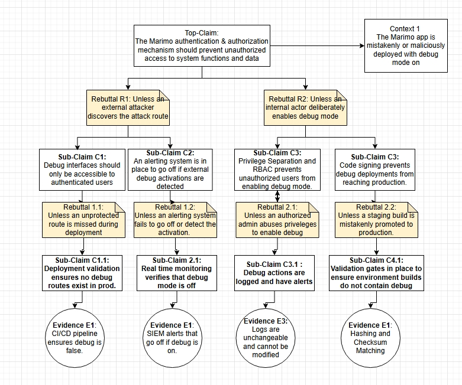

## Assurance Case: Execution Isolation in Marimo - Justin Tobiason

### 1. Overview

This assurance case focuses on **Execution Isolation** within the Marimo project.
The goal is to evaluate whether Marimo’s notebook execution environment can effectively prevent **untrusted user code** from accessing host system resources.

Because Marimo executes arbitrary Python code inside interactive notebook cells, strong isolation controls are required to ensure user-level code cannot escape its intended runtime environment or compromise the underlying host system.

This claim is critical because Marimo’s primary function—reactive code execution—presents inherent risks if isolation is incomplete or misconfigured.

### 2. Top-Level Claim (C1)

**C1:**
*The execution environment prevents host resource access by untrusted code.*

**Intent:**
This claim asserts that when a notebook is executed, it runs within a confined environment that protects the host system’s confidentiality, integrity, and availability.

### 3. Argument Summary

The argument to support this claim is structured around **three key assurance dimensions**:

1. **Systemic Isolation Controls:**The system’s containerization and sandboxing features prevent untrusted code from escaping into the host.
2. **Configuration and Deployment Assurance:**Security configurations (capabilities, mount restrictions, network policies) are actively managed and verified.
3. **Runtime Safeguards:**
   Timeouts and resource limits restrict denial-of-service or covert channel attacks.

Each of these elements is supported by subclaims and tangible evidence, with corresponding rebuttals and refutations.

### 4. Diagram

### 5. AI Summary

I was able to use AI to help expand on futhur rebuttals that could be assessed. By challenging my current claims I proposed my claims with the guidance on how to write a good claim by providing the criteria that make up a good claim. I was able to go from simple less direct claims to something that could provide a reasonable outcome.

---

## Assurance Case: Data Loss Prevention in Marimo - Osmar Carboney

### 1. Overview

This assurance case focuses on **Data Exfiltration Prevention** within the Marimo project. The goal is to evaluate whether Marimo’s notebook interface can effectively prevent unauthorized internal or external actors from leaking sensitive data. Because Marimo enables interactive code execution and notebook export, strong controls are required to ensure that sensitive information is not exfiltrated through misuse, misconfiguration, or malicious code.

This claim is critical because Marimo is often deployed in environments where analysts handle regulated data (e.g., financial records, PII), and any leakage could result in compliance violations or reputational damage.

### 2. Top-Level Claim (C1)

**C1:**
*Marimo prevents unauthorized data exfiltration by internal and external actors.*

**Intent:**
This claim asserts that Marimo enforces layered controls—access restrictions, audit logging, data scanning, and query validation—to ensure that sensitive data cannot be exported or leaked without authorization.

### 3. Argument Summary

The argument to support this claim is structured around four key assurance dimensions:

1. **Access Control Enforcement:** Role-based access control (RBAC) ensures only authorized users can export notebooks or query sensitive data.
2. **Immutable Audit Logging:** All notebook executions and exports are logged in an append-only format to support forensic analysis.
3. **Data Leakage Prevention (DLP):**
   Automated scanning detects sensitive fields (e.g., SSNs, credit cards) before export and blocks unauthorized attempts.
4. **SQL Query Validation:** Parameterized query enforcement and runtime detection prevent injection-based exfiltration.

Each of these elements is supported by subclaims and tangible evidence, with corresponding rebuttals and refutations.

### 4. Diagram

### 5. AI Summary

I used AI to help structure the assurance case around critical misuse scenarios and stakeholder concerns. By identifying high-risk vectors for data exfiltration, I was able to construct layered claims supported by measurable evidence. The rebuttals were crafted to reflect realistic failure modes, and the subclaims were designed to show how Marimo mitigates each risk.

This exercise helped refine the clarity and depth of the argument, ensuring that each branch terminates in tangible, inspectable artifacts that stakeholders can verify.

---

## Assurance Case: Confidentiality of Data in Transit in Marimo – Dominic Lanzante  
**Focus Area:** Data Confidentiality & Secure Transport  

### 1. Overview  
This assurance case addresses **Confidentiality of Data in Transit** within the **Marimo** open-source reactive Python notebook.  

Its objective is to determine whether Marimo ensures that data exchanged between its client and backend components remains **confidential, tamper-resistant, and protected** from interception or disclosure.  

Because Marimo executes reactive Python code in a **client–server model**, protecting transmitted notebook content, execution metadata, and code outputs is critical to overall system trustworthiness.  

If transport-layer protections are misconfigured, downgraded, or certificate validation is bypassed, sensitive data could be intercepted or modified.  

This assurance case therefore examines Marimo’s **transport-layer security posture, authentication mechanisms, deployment hardening, and continuous verification processes** that collectively safeguard data in motion.  

### 2. Top-Level Claim (C1)  

**Entity:** *Marimo*  
The open-source reactive Python notebook platform that executes user-defined Python code within a client–server environment. Marimo’s architecture consists of a browser-based client interface and a backend runtime environment responsible for code execution and result delivery.  

**Property:** *Confidentiality of data in transit*  
This refers to the protection of all information transmitted between Marimo’s client and backend systems—such as user code, execution results, metadata, and session data—from unauthorized disclosure or interception during transmission. The assurance focus is on ensuring that no third party can access, observe, or manipulate data exchanged over the network.  

**Value (+ uncertainty):** *Ensured (assuming secure transport configuration and validation)*  
Confidentiality is ensured under the condition that Marimo’s deployment enforces secure communication protocols—specifically **TLS 1.2 or higher**, **HTTPS**, and **HSTS**—and that **certificate validation** is properly implemented and maintained.  
Residual uncertainty remains if transport configurations are misapplied, downgraded, or certificate validation mechanisms are bypassed. These environmental assumptions define the conditions under which the assurance claim holds true.  

> **Top-Level Claim C1:** *Marimo ensures confidentiality of data in transit between client and backend systems.*

**Intent:**  
All data transmitted between Marimo’s client interface and backend runtime remains protected against unauthorized access or disclosure, provided that **TLS 1.2+/1.3**, **HTTPS**, and **HSTS** are correctly enforced and validated.

### 3. Argument Summary  

The argument supporting this claim is structured around **five assurance dimensions**, each countering a specific rebuttal and supported by measurable evidence.

#### 3.1 Mutual Authenticity & Session Integrity (SC1)  
Server certificates and session tokens authenticate both endpoints to maintain message integrity and resist impersonation.  

- **Rebuttal R1:** Unless certificate validation is bypassed despite policy.  
- **Rebuttal R2:** Unless certificate validation or tokens are invalid or leaked.  
- **Evidence:**  
  - `marimo/_server/asgi.py`  *(ASGI authentication and bootstrap)*  
  - `marimo/_server/tokens.py`  *(Session and token management)*  

#### 3.2 Verified Encryption Policies (SC2)  
Continuous-integration tests verify TLS enforcement and detect regressions in encryption coverage.  

- **Rebuttal R3:** Unless transport verification tests lack sufficient coverage to detect regressions.  
- **Evidence:**  
  - `marimo/tests/security/test_transport_tls.py`  *(Proposed Transport TLS regression test)*  
  - `artifacts/zap_report.html`  *(Security scan artifacts / DAST report)*  

> **Note:** The `tests/security` directory does **not currently exist** in the public Marimo repository.  
> It is referenced here as a **recommended addition** to establish formal transport and encryption verification within Marimo’s CI pipeline.  

#### 3.3 Transport Policy Enforced (SC3)  
Marimo enforces HTTPS-only connections using TLS 1.2+/1.3 and HSTS to prevent downgrade or plaintext exposure.  

- **Rebuttal R4:** Unless TLS/HSTS policies are misconfigured or downgraded.  
- **Evidence:**  
  - `infra/nginx/nginx.conf`  *(Reverse-proxy TLS/HSTS policy)*  
  - `tests/test_loggers.py`  *(Transport logging checks)*  

#### 3.4 Client-Side & Log Sanitization (SC4)  
Header policies and sanitized logging prevent sensitive information from leaking through headers, cookies, URLs, or application logs.  

- **Rebuttal R5:** Unless client-side policies leak via headers, cookies, URLs, or logs.  
- **Evidence:**  
  - `marimo/tests/test_api.py`  *(API and header behavior tests)*  
  - `marimo/_server/logging.py`  *(Sanitized logging implementation)*  
  - `marimo/tests/security/test_headers_policy.py`  *(Proposed Header/CSP policy test)*  

#### 3.5 Hardened Deployment (SC5)  
Deployment configurations are hardened to prevent plaintext exposure through reverse proxies or insecure flags.  

- **Rebuttal R6:** Unless deployment exposes plaintext (reverse-proxy hop / insecure flags).  
- **Evidence:**  
  - `docs/programmatic_server.md`  *(Programmatic server hardening guide)*  
  - `Procfile / systemd`  *(Runtime manifests and secure deployment settings)*  

### 4. Supporting Reasoning  

**Context (CT1):** Marimo executes Python code between client and backend processes.  

**Inference Rule (IR1):** If TLS and HSTS are enforced and certificate validation is implemented, then data in transit remains confidential.  

**Undercut (UC1):** Unless certificate validation is bypassed.  

These reasoning elements form the logical backbone of the assurance argument, illustrating how secure transport enforcement, endpoint authentication, and verification layers collectively maintain confidentiality.

### 5. Diagram  
**Figure 1.** Assurance case diagram illustrating how Marimo ensures confidentiality of data in transit. 

Claims are represented by white rectangles, Context elements are in rounded white boxes, Rebuttals in yellow notes, Evidence in circles, and inference elements in blue, and undercut conditions in red.

### 6. AI Assistance Summary  
AI tools were initially intended to be used for this deliverable to assist with diagram generation, phrasing, and overall structure of the assurance case. However, during the development process, it became evident that the AI-generated diagrams and related outputs were inaccurate, misleading, and inconsistent with both the course material and the Marimo project’s architecture.

The diagrams produced by AI were not representative of the actual assurance case being referenced, and much of the supporting information provided was either false, fabricated, hallucinated, or irrelevant to the assignment’s requirements. Due to this unreliability, AI was ultimately not relied upon for any substantive portion of this project.

Instead, I turned to the course textbooks, professor-guided instructional videos, and independent manual analysis of Marimo’s repository to ensure accuracy and alignment with formal assurance-case standards. These materials provided the precise guidance necessary to correctly construct the argument structure, connect claims and rebuttals, and ground the evidence in verifiable sources.

AI was therefore used only in a limited capacity for minor phrasing and formatting adjustments, while the reasoning, diagram, and evidence relationships were developed entirely through manual research and instructor-led methodology.

### 7. Final Note  
This assurance case provides a **comprehensive and evidence-based argument** that Marimo maintains confidentiality of data in transit through:  

- Enforced transport-layer security (TLS 1.2+/1.3, HSTS)  
- Authenticated client–server session management  
- Sanitized logging and CSP/header controls  
- Hardened deployment and runtime configuration  
- Verified encryption and continuous testing via the proposed `tests/security` suite  

Collectively, these elements demonstrate that **Marimo ensures confidentiality of data in transit** and establishes a foundation for enhanced security assurance in future releases.

---

## Assurance Case: Authentication & Authorization mechanisms with debug mode - Zaid Kakish

### 1. Overview

This assurance case focuses on **Authentication and Authorization**, particulary on debug mode. The goal of this assurance case is to evaluate the security measures for Marimo when handling how an external actor could potentially access debug mode, and if there any protection mechanisms like authentication and authorization to prevent this unauthorized access. In addition, security measures for internal actors are also examined and the possibilites of an attack there.

### 2. Top-Level Claim (C1)
C1: The Marimo authentication & authorization mechanism should prevent unauthorized access to system functions and data 

**Intent**: This claim focuses the idea that there should always be an authentication and authorization mechanism to protect againt exploitations.

### 3. Argument Summary
These are the key arguments for this claim:
   1 - **External Authentication & Authorization mechanisms**: Mechanisms suchs as two factor and RBAC should be used to ensure that only authorized users can access key components.
   2- **SIEM Alerts**: Systems with alerts to ensure that any external debug mode activations are detected and alerted.
   3- **CI/CD pipelines for debug detection**: Systems in place that can prevent publications of production models that could have debug mode features.

### 4. Diagram

---
# Part 2 - Reflection

## Justin Tobiason

This assignment challenged my ability to question everything. I had to consider avenues that were not as obvious. Considering the depth of what was possible there is a certain threshhold for accuratly mitigating risk based on evidence in the project.

The most valuable thing in this assignment was learning how to build out one of these diagrams. Wording each piece in a way that made sense and helped with the flow of each claim, rebuttal, evidence, inference, etc.

## Osmar Carboney

This assurance case challenged me to think like both a security architect and a threat actor. I had to consider how Marimo could be misused, and then build a structured defense using claims, rebuttals, and evidence. The most valuable part was learning how to translate abstract security goals into concrete, inspectable arguments that can guide trust decisions.

I now see how assurance cases can be used not just for documentation, but as a strategic tool for adoption, stakeholder alignment, and continuous improvement.

## Dominic Lanzante  

Working on this assurance case deepened my understanding of how security claims must be built on **verifiable, technical evidence**, not just theoretical reasoning. Focusing on the **confidentiality of data in transit** helped me think critically about how TLS configurations, authentication mechanisms, and encryption verification tests interact to maintain secure communication within open-source systems like Marimo. As I aligned my evidence to the Marimo repository, I realized that while many elements such as `asgi.py`, `tokens.py`, and `nginx.conf` provide strong existing support, others like the proposed `tests/security/test_transport_tls.py` and `test_headers_policy.py` represent future improvements that could strengthen Marimo’s CI security validation. Identifying this gap reinforced how assurance work doesn’t just prove security, it also **drives security maturity** by showing where verification needs to be added.  

The biggest challenge I faced was translating the structure I envisioned into a clear, professional diagram in **draw.io**. I knew how the relationships between claims, rebuttals, and evidence should flow, but achieving that balance between **technical accuracy and visual clarity** took considerable effort. At the same time, organizing all the documentation, connecting it to specific evidence, and ensuring consistency across the argument forced me to slow down and think systematically rather than just technically.  

Despite those challenges, this project was extremely rewarding. It helped me connect my hands-on network security experience with formal assurance reasoning, transforming what I intuitively understand into something that can be **communicated, justified, and trusted** by others. I’m proud of how my confidentiality case evolved, especially in demonstrating how evidence-based reasoning and structured documentation can reinforce Marimo’s ability to safeguard data in transit and highlight future opportunities for stronger, test-driven assurance.  

---
# Team Reflection

