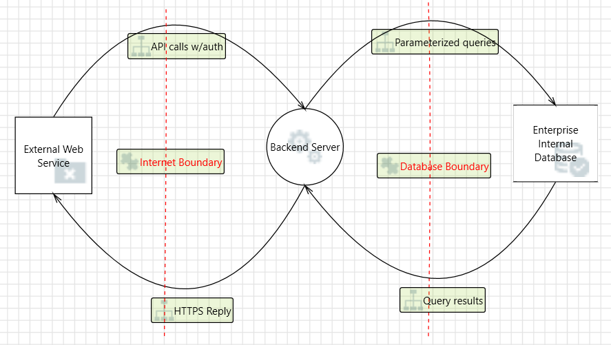

# Part 1: Threat Modeling – Marimo Level 1 Threat Model (Team 4)

This section documents the Level 1 Threat Modeling Report for the Marimo application, created as part of  
**CYBR 8420 – Designing for Software Security Engineering** under **Dr. Robin Gandhi**.

The report was generated using the **Microsoft Threat Modeling Tool (TM7)** and exported as an HTML artifact.  
We provide both the **HTML preview** (for full detail) and the **diagram snapshot** for quick reference.

---

## HTML Preview – Full Threat Modeling Report

Click below to view the fully rendered threat modeling report:

**HTML Preview:**  
https://htmlpreview.github.io/?https://github.com/os2594/Team4/blob/main/docs/4.Design/Marimo_Threat_Modeling_Report_Level1.htm

> This preview contains the full STRIDE threat list, mitigations, assumptions, external dependencies,  
> and all auto-generated Microsoft Threat Modeling Tool content.

---

## Summary of What This Report Contains

The HTML report includes:

- High-Level System Description (Marimo architecture overview)  
- System assumptions and security boundaries  
- External dependencies  
- Full STRIDE threat enumeration  
- Mitigation justifications for each threat  
- Diagram summaries and data flow descriptions  
- Exported Microsoft TM7 data for professor review  

---

## Level 1 Data Flow Diagram (DFD)

Below is the visual representation of the Level 1 DFD used in our analysis.  
It captures the major architectural elements:

- External Web Client  
- Marimo Backend Server  
- Execution Sandbox  
- Internal File/Storage System  
- Internet and Storage Trust Boundaries  

### **Level 1 Diagram**

---

# 📝 Part 2: Observations, Collaborations, and Team Reflection

This section compares the mitigations expected from our threat model to what is actually implemented in the open-source Marimo project. It also includes our collaboration evidence and team reflection.

## Observations: Existing Security Controls in Marimo

During our review of Marimo’s open-source codebase and documentation, we identified several controls that align with the expected mitigations from our DFD-based threat analysis:

- **Execution Sandbox Isolation:**  
  Marimo executes user code inside a controlled Python runtime, preventing direct access to system resources.

- **Reactive Dependency Graph Execution:**  
  Marimo controls execution order and notebook state transitions, reducing the risk of unintended control-flow manipulation.

- **Limited File Access:**  
  File operations are scoped only to notebook-related assets.

- **Expected Deployment Behind HTTPS/TLS:**  
  Documentation assumes secure HTTPS endpoints, protecting confidentiality and integrity of client–server communication.

- **Frontend/Backend Separation:**  
  The UI only communicates through defined API routes, strengthening boundary enforcement.

- **Stateless API Behavior:**  
  Predictable backend endpoints reduce ambiguity and simplify threat modeling.

These controls address multiple threats across Spoofing, Tampering, and Elevation of Privilege categories.

## Gaps and Missing Mitigations

Our analysis also revealed that several critical security mitigations are **not** implemented directly by Marimo:

- **No Built-in Authentication or Authorization:**  
  Any user with access to the backend port can issue API commands.

- **No TLS Enforcement:**  
  Security depends entirely on the deployment environment and reverse proxy.

- **Minimal Logging & Audit Capabilities:**  
  Repudiation threats are insufficiently mitigated.

- **No Rate Limiting or Execution Throttling:**  
  Leaves Marimo vulnerable to resource exhaustion and DoS attacks.

- **Not OS-Level Sandboxed:**  
  Python-level sandboxing is not fully isolated (e.g., seccomp, namespaces, containers).

- **Deployment-Specific Security Posture:**  
  Core mitigations depend on external infrastructure rather than Marimo itself.

These gaps represent the primary areas where Marimo differs from the ideal secure architecture defined in our threat model.

## Team Collaboration

Team 4 collaborated using a shared GitHub repository containing:

- TMT diagram files (`.tm7`)  
- HTML export of the threat model  
- Level 1 diagrams  
- Shared notes and design documents  
- Markdown documentation  
- Iterative updates and commit history

Team Repository Link:  
-> https://github.com/os2594/Team4

All work was coordinated through GitHub commits, messaging, and shared file editing.

## Team Reflection

**What we learned:**  
As a team, we gained practical experience in applying STRIDE using a real-world system. We learned how to map architectural components to trust boundaries and identify threats grounded in interactions between elements. The Microsoft TMT tool helped us better understand how threat modeling formalizes risk analysis.

**What we found most useful:**  
We found the automation of threat enumeration to be a helpful starting point, but the real value was in refining the relevance of each threat and determining appropriate mitigations. The exercise also strengthened our ability to analyze security gaps in OSS projects and improved our understanding of how architecture shapes security posture.

Overall, this assignment sharpened our skills in secure design, STRIDE analysis, and system-level reasoning—key competencies for secure software engineering.

---
